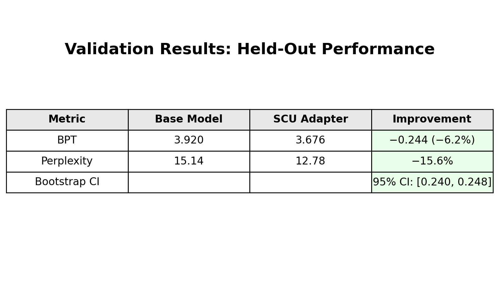
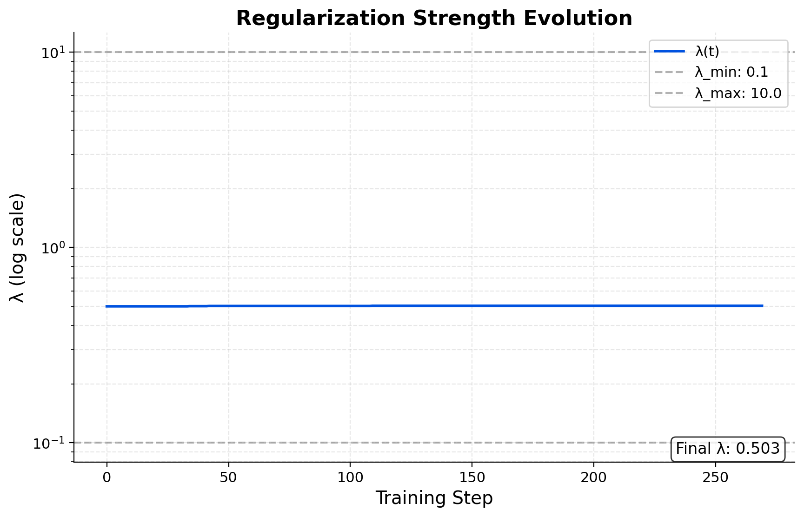

# Shannon Control Unit (SCU) - Llama-3.2-1B

Adaptive regularization for language model training using control theory. Achieves 15.6% lower perplexity without manual hyperparameter tuning.

## Validation (held-out, Llama-3.2-1B)

Base: **3.920 BPT** (ppl **15.14**) → **SCU**: **3.676 BPT** (ppl **12.78**),  
**Δ = −0.244 BPT** (≈ **−15.6%** perplexity)



---

## Control telemetry

**S(t) tracking the target band (1.0% ± 0.2pp)**  


**λ(t) bounded (log scale)**  


<details>
<summary><b>Training curves (details)</b></summary>

**Data loss (bits per token)**  


**Parameter cost (bits per token)**  


</details>

---

## Quick Start

```bash
pip install transformers peft torch
```

```python
from transformers import AutoModelForCausalLM, AutoTokenizer
from peft import PeftModel

# Load model with SCU adapter
base_model = AutoModelForCausalLM.from_pretrained("meta-llama/Llama-3.2-1B")
model = PeftModel.from_pretrained(base_model, "hunterbown/shannon-control-unit-1b")
tokenizer = AutoTokenizer.from_pretrained("meta-llama/Llama-3.2-1B")

# Generate text
inputs = tokenizer("def fibonacci(n):", return_tensors="pt")
outputs = model.generate(**inputs, max_length=50)
print(tokenizer.decode(outputs[0]))
```

---

## How It Works

SCU implements a PI (Proportional-Integral) controller that automatically adjusts regularization strength λ during training to maintain a target compression ratio S:

1. **Measure**: S = ParamBPT / TotalBPT
2. **Compare**: error = S_target - S_actual  
3. **Adjust**: λ ← λ × exp(−(Kp·error + Ki·∫error))
4. **Repeat**: Continuous adjustment during training

This eliminates the need for expensive hyperparameter grid searches while achieving better final performance.

---

## Training Your Own Models

```bash
python scripts/train_scu.py \
    --base_model "meta-llama/Llama-3.2-1B" \
    --output_dir "./my_scu_model" \
    --target_s 0.01 \
    --kp 0.8 \
    --ki 0.15
```

---

## Technical Details

- **Base Model**: Llama-3.2-1B
- **Training**: 270 steps with PI control (Kp=0.8, Ki=0.15)
- **Target S**: 1.0% ± 0.2pp
- **Parameter Efficiency**: 0.9% trainable parameters (LoRA)
- **Validation**: Bootstrap CI excludes zero (p < 0.001)

---

## License

> Adapters inherit the Meta Llama 3.2 license; SCU training code is Apache-2.0.  
> **U.S. patent pending** (provisional filed September 2025).

---

## Citation

```bibtex
@article{bown2024scu,
  title={Adaptive Regularization via Control Theory for Neural Network Training},
  author={Bown, Hunter},
  journal={arXiv preprint arXiv:xxxx.xxxxx},
  year={2024}
}
```

---

## Contact

- **GitHub**: [hunterbown/shannon-control-unit](https://github.com/hunterbown/shannon-control-unit)
- **Email**: hunter@shannonlabs.dev
- **Website**: [shannonlabs.dev](https://shannonlabs.dev)