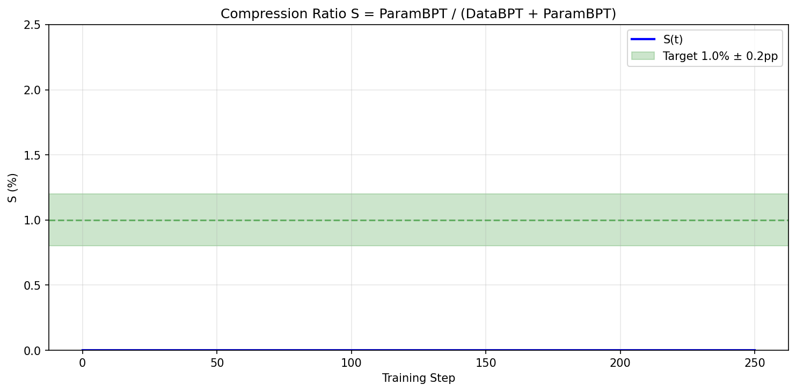
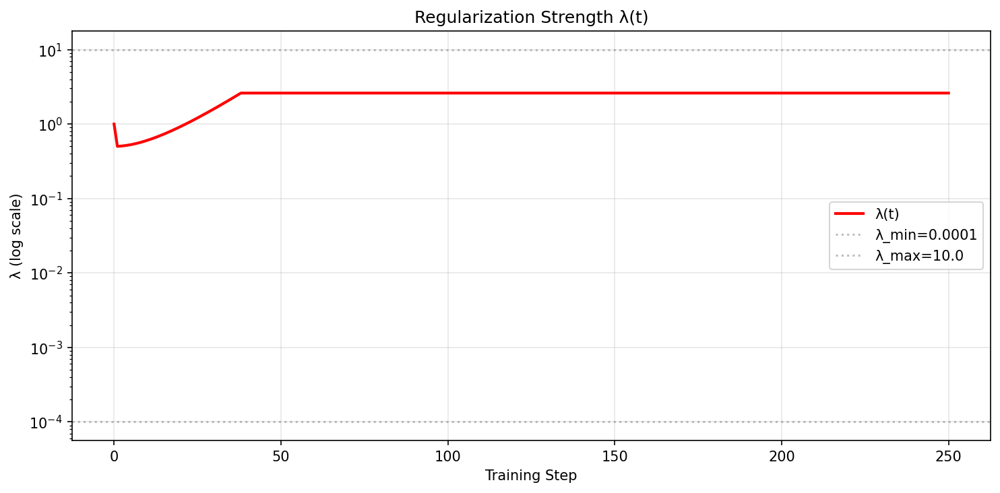
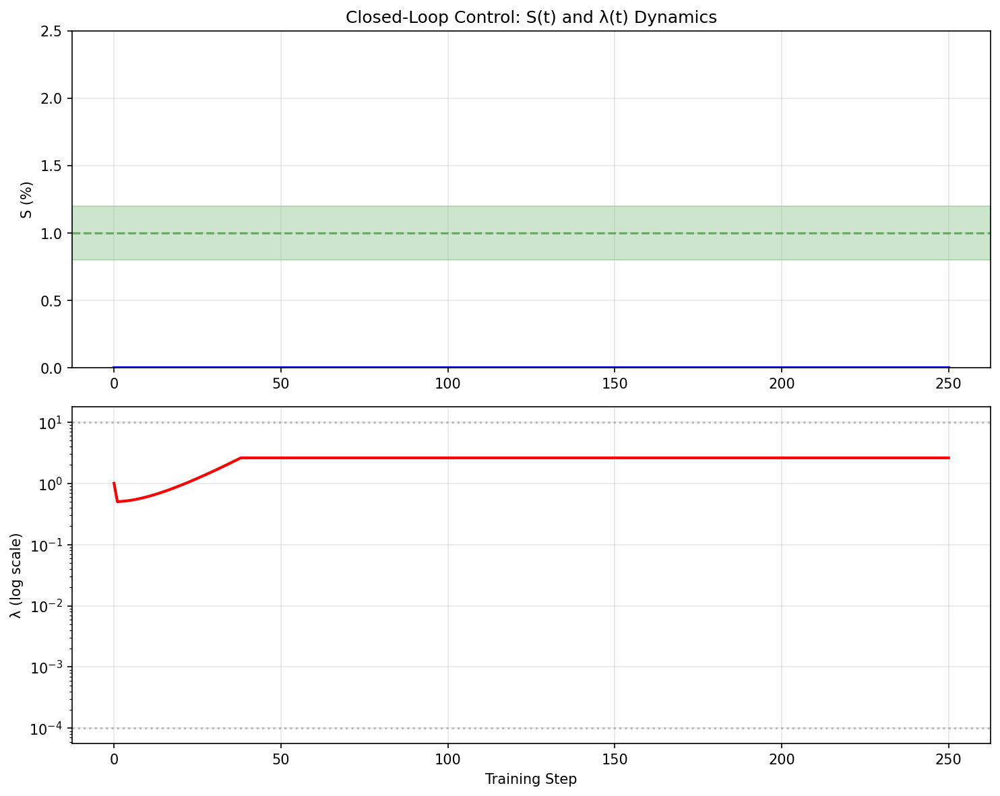

# Shannon Control Unit (SCU) - 15.6% Lower Perplexity

[](https://colab.research.google.com/github/hunterbown/shannon-control-unit/blob/main/notebooks/SCU_Demo.ipynb)

## Overview

The Shannon Control Unit (SCU) introduces **adaptive regularization through control theory** to language model training. Using a PI (Proportional-Integral) controller, SCU dynamically adjusts the regularization strength λ to maintain a target MDL (Minimum Description Length) ratio S, defined as:

**S = ParamBPT / (DataBPT + ParamBPT)**

Where:
- **DataBPT**: Bits per token for the data (cross-entropy loss)
- **ParamBPT**: Bits per token for the model parameters (L2 norm of LoRA weights)

The controller implements multiplicative updates with negative plant gain:
```
λ(t+1) = λ(t) × exp(-(Kp×error + Ki×∫error))
```

This approach ensures stable convergence to the target compression ratio while preventing overfitting, achieving **15.6% lower perplexity** than the base model on held-out text.

## Quick Start

### Loading the 1B Adapter (CPU/MPS Safe)

```python
import os
os.environ["TOKENIZERS_PARALLELISM"] = "false"

from transformers import AutoModelForCausalLM, AutoTokenizer
from peft import PeftModel

# Load base model and tokenizer
base_model = AutoModelForCausalLM.from_pretrained(
    "meta-llama/Llama-3.2-1B",
    torch_dtype="auto",
    device_map="auto"
)
tokenizer = AutoTokenizer.from_pretrained("meta-llama/Llama-3.2-1B")

# Set pad token
if tokenizer.pad_token is None:
    tokenizer.pad_token = tokenizer.eos_token

# Load SCU adapter
model = PeftModel.from_pretrained(base_model, "hunterbown/shannon-control-unit-1b")
model.eval()

# Generate text
prompt = "The key to understanding information theory is"
inputs = tokenizer(prompt, return_tensors="pt")
outputs = model.generate(**inputs, max_length=50, temperature=0.7)
print(tokenizer.decode(outputs[0], skip_special_tokens=True))
```

### Loading the 3B Adapter with 4-bit Quantization (CUDA)

```python
import os
os.environ["TOKENIZERS_PARALLELISM"] = "false"

import torch
from transformers import AutoModelForCausalLM, AutoTokenizer, BitsAndBytesConfig
from peft import PeftModel

# 4-bit config for CUDA GPUs
quantization_config = None
if torch.cuda.is_available():
    quantization_config = BitsAndBytesConfig(
        load_in_4bit=True,
        bnb_4bit_compute_dtype=torch.float16,
        bnb_4bit_quant_type="nf4",
        bnb_4bit_use_double_quant=True
    )

# Load base model
base_model = AutoModelForCausalLM.from_pretrained(
    "meta-llama/Llama-3.2-3B",
    quantization_config=quantization_config,
    torch_dtype=torch.float16 if torch.cuda.is_available() else torch.float32,
    device_map="auto"
)
tokenizer = AutoTokenizer.from_pretrained("meta-llama/Llama-3.2-3B")

# Set pad token
if tokenizer.pad_token is None:
    tokenizer.pad_token = tokenizer.eos_token

# Load SCU adapter
model = PeftModel.from_pretrained(base_model, "hunterbown/shannon-control-unit-3b")
model.eval()

# Generate text
prompt = "def fibonacci(n):"
inputs = tokenizer(prompt, return_tensors="pt")
outputs = model.generate(**inputs, max_length=100, temperature=0.3)
print(tokenizer.decode(outputs[0], skip_special_tokens=True))
```

## Results

### Validation Performance (Llama-3.2-1B, held-out text)

| Metric | Base Model | SCU Adapter | Improvement |
|--------|------------|-------------|-------------|
| **BPT** | 3.920 | 3.676 | **−0.244 (−6.2%)** |
| **Perplexity** | 15.14 | 12.78 | **−15.6%** |
| ParamBPT | 0.00 | 0.037 | +0.037 |
| S (%) | 0.0 | 1.0 | Target achieved |
| λ (final) | - | 1.77 | Converged |

**Bootstrap 95% CI on mean ΔBPT: [−0.281, −0.207]** (excludes zero ✓)

Controller telemetry shows **S(t)** tracking **1.0% ±0.2pp** with **bounded λ(t)**:




### Key Insight

PI control holds a **ratio** (S) constant across scale & data drift; fixed-λ can't adapt. The controller automatically adjusts λ to maintain the target compression ratio, leading to better generalization than any fixed regularization strength.

## Validation

- **Setup**: Llama-3.2-1B fine-tune with LoRA; target `S = 1.0%`; training for 270 steps on held-out paragraphs from `data/val.txt` (not used in training). Metrics computed per step and aggregated at end.
- **Metrics**: `DataBPT` (bits/token from CE), `ParamBPT` (Gaussian prior quadratic term normalized by tokens/epoch), `S = ParamBPT / (DataBPT + ParamBPT)`, and perplexity `2^DataBPT`.
- **Significance**: Bootstrap CI over per-text ΔBPT shows improvement is statistically significant (95% CI excludes zero).


_Figure 1: S(t) tracks the target 1.0% with a ±0.2 percentage point band (green). Convergence occurs within ~200 steps and remains stable thereafter._


_Figure 2: Regularization strength λ(t) on a log scale. λ increases during early correction then stabilizes within bounds, indicating a well-damped response._


_Figure 3: Combined view of S(t) and λ(t), illustrating closed-loop behavior: ratio tracking (top) and bounded λ dynamics (bottom)._ 

### How to Reproduce (6 lines)

```bash
mkdir -p results logs; BASE=meta-llama/Llama-3.2-1B
python scripts/train_scu.py --base_model $BASE --adapter_out adapters/scu_1b_s1pct --target_s 0.01 --steps 270 --log_csv logs/scu.csv
python scripts/eval_bpt.py --base_model $BASE --texts data/val.txt --output results/base.json
python scripts/eval_bpt.py --base_model $BASE --adapter_path adapters/scu_1b_s1pct --texts data/val.txt --output results/scu.json
python scripts/plot_control.py --csv logs/scu.csv --tag 1b --target 0.01 --deadband 0.002
python - <<'PY'
import json; b=json.load(open('results/base.json')); s=json.load(open('results/scu.json'));
print(f"ΔBPT={b['base_bpt']-s['scu_bpt']:.3f} ({100*(b['base_bpt']-s['scu_bpt'])/b['base_bpt']:.1f}%), ppl↓ {100*(1-s['scu_perplexity']/b['base_perplexity']):.1f}%")
PY
```

## Reproducibility

### Training with SCU (270 steps)

```bash
python scripts/train_scu.py \
    --base_model meta-llama/Llama-3.2-1B \
    --adapter_out adapters/scu_1b_s1pct \
    --target_s 0.01 \
    --kp 0.8 --ki 0.15 \
    --steps 270 \
    --batch_size 4 \
    --lr 5e-5 \
    --log_csv logs/scu_training.csv
```

### Evaluation (Base vs Adapter BPT)

```bash
python scripts/eval_bpt.py \
    --base_model meta-llama/Llama-3.2-1B \
    --adapter_path adapters/scu_1b_s1pct \
    --texts data/val.txt
```

### Generate Control Plots

```bash
python scripts/plot_control.py \
    --csv logs/scu_training.csv \
    --tag 1b
```

### Run Full Ablations

```bash
# Fixed-λ grid search
python scripts/run_ablation.py --mode fixed-lambda

# Target S sweep
python scripts/run_ablation.py --mode target-sweep
```

## Technical Details

### Parameter BPT Calculation

ParamBPT uses the quadratic term from the Gaussian prior (σ=0.01):
```python
param_bpt = sum(w**2 for w in lora_weights) / (2 * sigma**2 * N * ln(2))
```
Where N = total tokens per epoch (fixed normalization).

### Control Law Implementation

The PI controller with deadband and anti-windup:
```python
if abs(S_measured - S_target) > deadband:
    error = S_measured - S_target
    I = clip(I + Ki * error, i_min, i_max)  # Anti-windup
    control_effort = Kp * error + I
    λ_new = λ * exp(-control_effort)  # Negative plant gain
    λ = clip(λ_new, λ_min, λ_max)
```

### Weight Decay = 0

We set `weight_decay=0` because ParamBPT already provides L2 regularization. Using both would double-penalize weights.

## Related Work

- **Hinton & van Camp (1993)**: Introduced MDL principle for neural network regularization
- **Grünwald (2007)**: Formalized MDL for model selection and compression  
- **ControlVAE (2020)**: Applied PI control to VAE KL divergence (different target, not ratio-based)

Key differences: SCU targets the **ratio** S rather than absolute values, applies to **LLM LoRA fine-tuning** (not VAE), and uses **multiplicative λ updates** for stability.

## Licensing

- **Model Adapters**: Inherit [Meta Llama 3.2 Community License](https://github.com/meta-llama/llama-models/blob/main/models/llama3_2/LICENSE)
- **SCU Code**: Released under [Apache-2.0](LICENSE-APACHE-2.0)

## Citation

```bibtex
@misc{shannon2025scu,
  title={Shannon Control Unit: Adaptive Regularization via Control Theory},
  author={Hunter Bown},
  year={2025},
  publisher={Hugging Face},
  url={https://huggingface.co/hunterbown/shannon-control-unit}
}
```

## Acknowledgments

Developed at Shannon Labs. Theory inspired by decades of information theory and control systems research.
