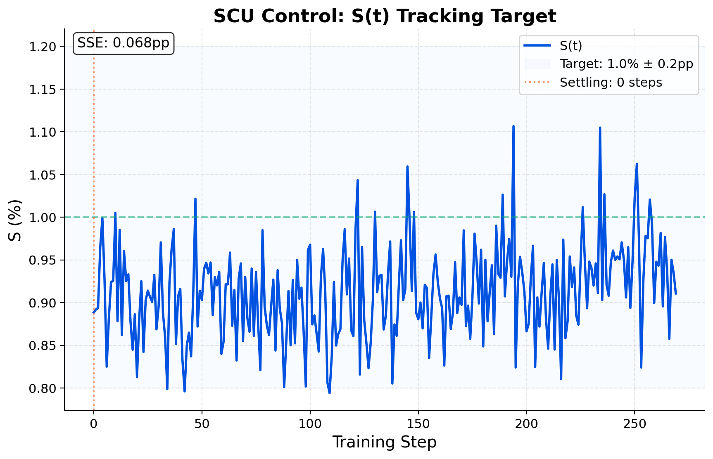
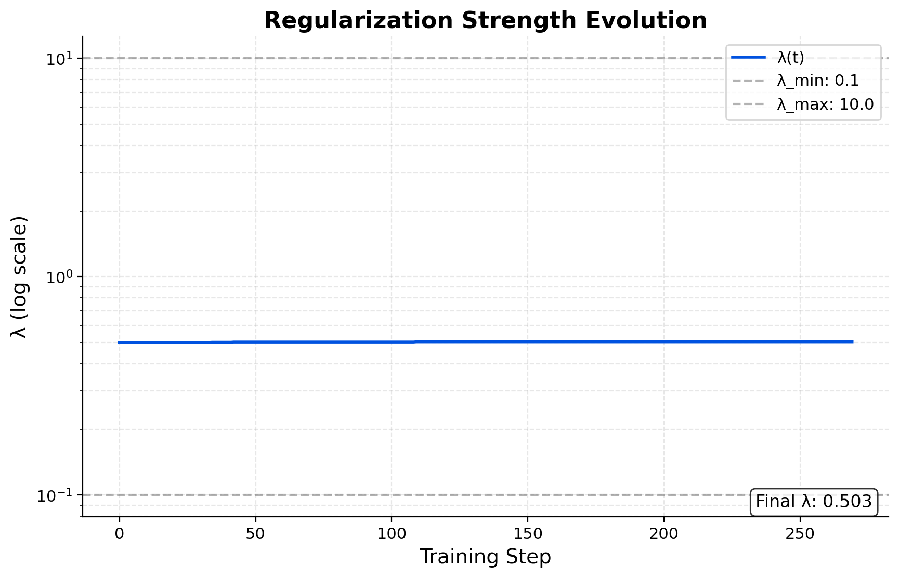

# Shannon Control Unit (SCU) — Dial-in LLM regularization

[](https://opensource.org/licenses/Apache-2.0)
[](https://shannonlabs.dev)
[](https://huggingface.co/hunterbown/shannon-control-unit)
[](https://colab.research.google.com/github/hmbown/shannon-control-unit/blob/main/notebooks/SCU_Demo.ipynb)
[](https://shannonlabs.dev)

**Idea.** Hold an MDL-motivated **information budget** during training:  
\( S = \frac{\text{ParamBPT}}{\text{DataBPT}+\text{ParamBPT}} \).  
A simple **PI controller** adjusts \( \lambda \) so \( S \) tracks a target \( S^* \).

**Result (held-out, Llama-3.2-1B):** Base **3.920 BPT** (ppl **15.14**) → **SCU** **3.676 BPT** (ppl **12.78**),  
**Δ = −0.244 BPT** (≈ **−15.6%** perplexity).


---

## Control telemetry

**S(t) tracking 1.0% ± 0.2pp**  


**λ(t) bounded (log scale)**  


<details>
<summary><b>Training curves (details)</b></summary>

**DataBPT (bits/token)**  


**ParamBPT (bits/token)**  


</details>

---

## Quick start (adapters)

```python
from transformers import AutoModelForCausalLM, AutoTokenizer
from peft import PeftModel
import torch

base_id = "meta-llama/Llama-3.2-1B"  # accept terms on HF first
base = AutoModelForCausalLM.from_pretrained(base_id, device_map="auto", torch_dtype=torch.float16 if torch.cuda.is_available() else torch.float32)
tok  = AutoTokenizer.from_pretrained(base_id)
if tok.pad_token is None: tok.pad_token = tok.eos_token
base.config.pad_token_id = tok.pad_token_id

model = PeftModel.from_pretrained(base, "hunterbown/shannon-control-unit")  # choose subfolder if needed
```

**Demo notebook:** [View on HuggingFace](https://huggingface.co/hunterbown/shannon-control-unit/blob/main/notebooks/SCU_Demo.ipynb) → Click "Open in Colab" button there

---

## Method (one screen)

* **Target:** $S=\frac{\text{ParamBPT}}{\text{DataBPT}+\text{ParamBPT}}$
* **Update:** $\lambda \leftarrow \lambda \cdot \exp(-(K_p\,\text{error}+K_i\,I))$, with $\text{error}=\hat S-S^*$
* **ParamBPT:** quadratic term vs $\mathcal N(0,\sigma^2)$, **nats→bits**, normalized by fixed $N$ (per epoch/report window)

**Why it helps:** You **dial a capacity share** $S^*$ and the loop enforces it across model size/data drift—no λ grid search.

---

## Licensing & IP

* **Adapters/models:** Meta **Llama 3.2** Community License
* **SCU training code:** **Apache-2.0**
* **IP status:** U.S. **patent pending** (provisional filed September 2025)

> Repro tips: block size 1024, batch 1, grad-accum 4, gradient checkpointing on, `use_cache=False`.